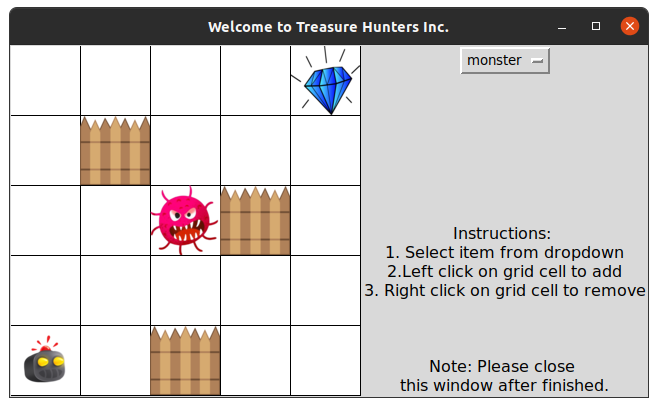
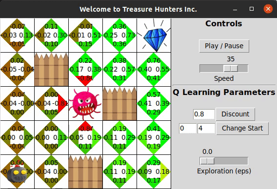
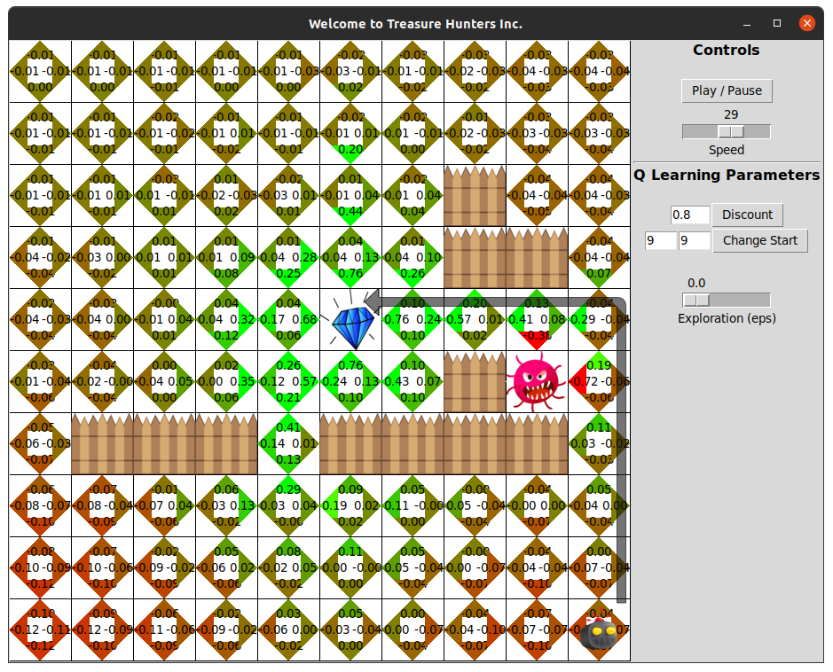

# Treasure Hunters Inc. [](https://www.python.org/) 

## We do the treasure hunting and monster fighting for you

1. The map must be saved as a text file with the following format:

    0 0 0 0 3  
    0 1 1 0 4  
    0 1 1 0 0  
    0 0 0 0 0  
    2 0 0 0 0  

    where, 1 is Wall (or Obstacles), 2 is Agent, 3 is Treasure, 4 is Monster (or Pit)

2. Terminal commands

```python
python3 q_deterministic.py
python3 q_stochastic.py
```
3. Features
- Grid world GUI
- Create new maps or load stored maps with dynamic grid size
- Embedded controls to change the parameter values such as start point, exploration (eps), discount, and simulation speed

<p align="center">

</p>


### 1. Reinforcement Learning

#### Q Learning Parameters
<p align="center">

</p>

1. R(s):
For every action from current state, the agent gets an immediate walk/live
reward of -0.05. This ensures that the agent doesn’t keeps on trying a bad
action like hitting a wall continuously.


2. Discount (γ) :
This defines the portion of the next state reward that the agent gets for a
given action. This value is 0.8 (i.e. 80%) for this implementation.


3. T(s, a, s’):
T defines the transition model, which is the probability of landing in a new
state from current state by taking an action a.


In deterministic learning, the probability of getting into a new state s’ from
the current state s by taking the action a is always 1 and is 0 for all other
actions.

In stochastic learning, this probability is spread across different actions. For
this implementation, probability of s’ from s by taking a is 0.6 while it is 0.1
for the other three actions and 0.1 for staying at the same place.

#### Convergence:
The above equation gives a new Q value for a given action. When the agent
is in the learning phase, a higher weight is given to the new Q values as
compared to the previously learned Q value due to high uncertainty.
However as the number of iteration increases, the weight of the newer Q
values decreases and the weight of the older Q values increases as the
uncertainty decreases over time.

The learning rate α which is a function of number of iteration controls the
convergence of Q table.

<p align="center">

</p>
<p align="center">

</p>

- The total number of episodes or iterations are limited to 10000 by default
and can be changed in the program.
- In each episode, the agent starts again after 300 steps.


#### Exploration:
Epsilon - Probability of taking an action other than optimum action.
Choice of actions:
1. Always Greedy:
When the value of epsilon is zero, the agent always takes an optimum
action from current state. Thus the chances of staying in a local minima
is high.

2. Always Random:
When the value of epsilon is one, the agent always takes an action which
is not optimum. Although the Q table will be updated with the highest
reward path, the agent will always keep on exploring without moving on
the highest reward path.

3. Softmax Exploration (Simulated Annealing):
The Softmax exploration biases the exploration towards higher reward
actions. Boltzmann distribution gives a fair estimate of an action in the
direction of high reward action using the Q values encountered.

<p align="center">

</p>

In the current implementation, we have a function to get the current
softmax value. However, by default it is disabled to give interactive control
of epsilon value to the user in the GUI. In order to switch between softmax
policy and manual control epsilon, use one of the following statement in the
q_learn method.

```python
epsilon = World.w2.get()
# epsilon = soft_max(current, iter)
```


### Demonstration:
#### Heat Map
<p align="left">

</p>

#### Deterministic Learning

#### Stochastic Learning


### Experiments
- Example 1 

Deterministic Learning  
The agent goes through the shortest path to get more reward, even if it has
a monster along that path. This is because the transition model is such that
the agent will never reach the monster once it has learned the Q values.

<p align="center">

</p>


Stochastic Learning  
We can see that for stochastic version of the above map, the agent chose a
different path because the reward in the previous path (with monster) has been
reduced due to the transition model effect from neighboring states.

<p align="center">

</p>

- Example 2  

Deterministic Learning 
The agent goes through the shortest path to get more reward, even if it has
a monster along that path. This is because the transition model is such that
the agent will never reach the monster once it has learned the Q values.

<p align="center">

</p>

Stochastic Learning  
We can see that for stochastic version of the above map, the agent chose a
different path because the reward in the previous path (with monster) has been
reduced due to the transition model effect from neighboring states.

<p align="center">

</p>

### YouTube Demo:

[Q-learning in grid world](https://youtu.be/a_wkkZSHKzc)

### References
1. http://theory.stanford.edu/~amitp/GameProgramming/Heuristics.html#breaking-ties
2. http://ai.berkeley.edu/lecture_videos.html
